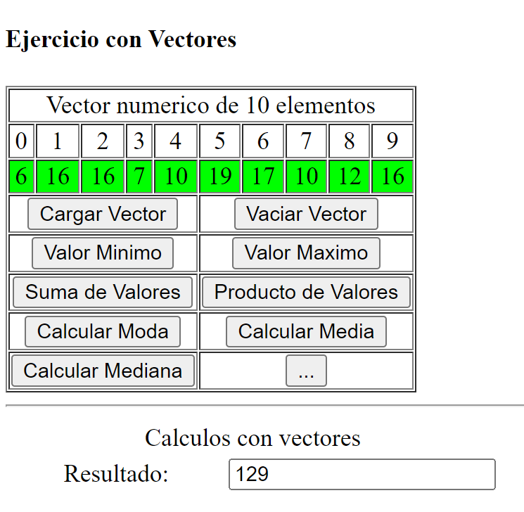

# Curso-Técnica-de-programación-UNEMI
Algoritmos, JavaScript, Python
# Ejercicios con Vectores
Ejercicio con vectores para desarrollar logica y destrezas de programacion del estudiantes.

### interfaz grafica del Ejercicio con Vectores:

